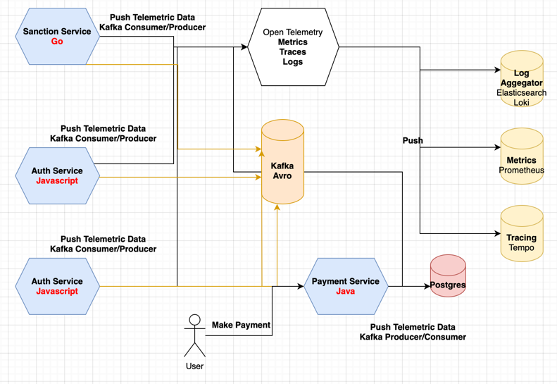

# Tracing Requests Across Services with OpenTelemetry

POC to trace request across multiple services using [OpenTelemetry](https://opentelemetry.io) more details at https://www.linkedin.com/pulse/tracing-requests-across-multiple-services-part-2-rodrigo-rodrigues-ben2e




### Google Oauth2 Credential

https://developers.google.com/identity/openid-connect/openid-connect

### Installation

```
#First build kafka dependencies
docker-compose up -d kafka zookeeper schema-registry

#Then push schema
cd payment-service
$ mvn schema-registry:register

cd ..
#To build go service use
BUILDKIT_PROGRESS=plain docker-compose up -d sanction-service-golang

#For the others

docker-compose up -d
```

### References

* [Spring Cloud Sleuth Headers](https://cloud.spring.io/spring-cloud-sleuth/2.0.x/multi/multi__propagation.html)
* [Spring Boot B3 Propagation Sample](https://github.com/cassiomolin/log-aggregation-spring-boot-elastic-stack)
* [Spring Boot Logstash Sample](https://github.com/classicPintus/spring-boot-elk)
* [Python Flask Logstash Sample](https://www.techchorus.net/blog/logging-from-flask-application-to-elasticsearch-via-logstash/)
* [Spring Boot 3 Otlp Support](https://github.com/spring-projects/spring-boot/issues/37278)
* [Spring Boot 2 Otlp Log Exporter Sample](https://github.com/ff-sdesai/distributed-tracing-spring/tree/main)
* [Grafana OpenTelemetry Spring Boot Support](https://grafana.com/docs/opentelemetry/instrumentation/java/spring-starter/)
* [Spring Boot 3 Tracing](https://github.com/micrometer-metrics/tracing/wiki/Spring-Cloud-Sleuth-3.1-Migration-Guide)
* [Python OpenTelemetry Trace](https://newrelic.com/blog/how-to-relic/opentelemetry-full-stack-javascript)
* [Spring Webflux Tracing](https://stackoverflow.com/a/77707351/2669657)
* [Redirect Docker Logs to Fluent-Bit](https://medium.com/@thakkaryash94/docker-centralized-logging-using-fluent-bit-grafana-and-loki-bc6784406432)